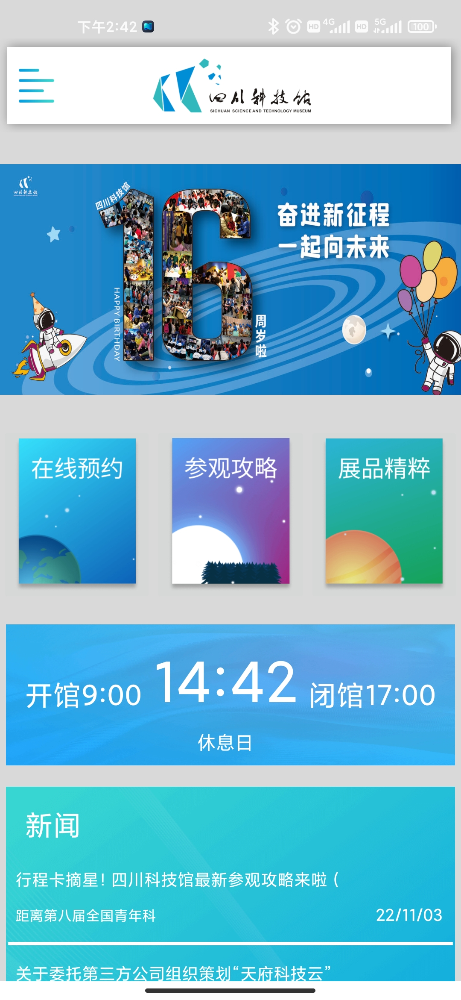
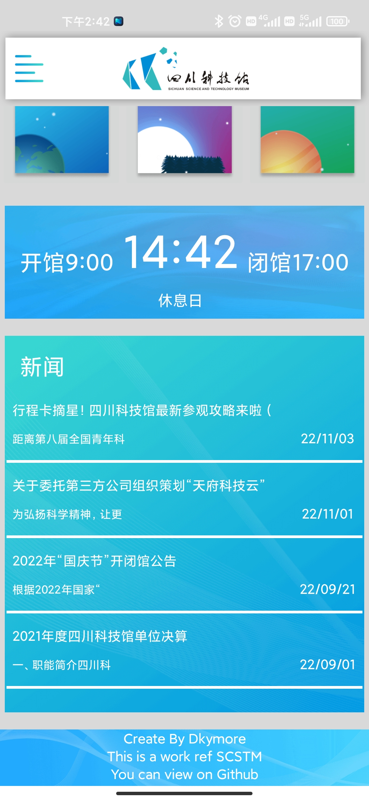
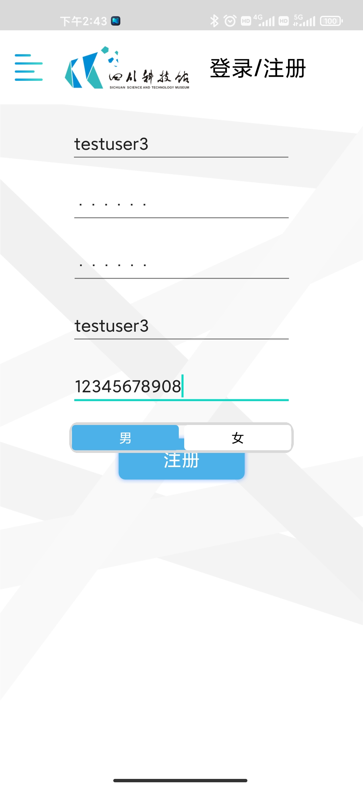
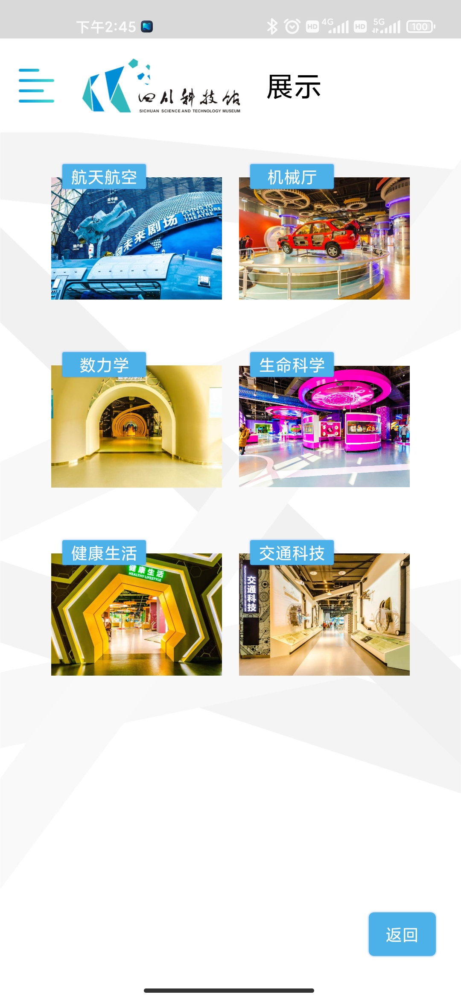
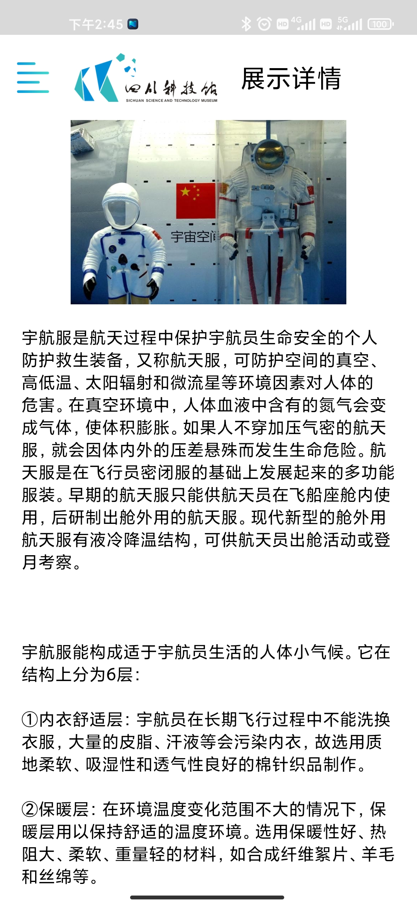
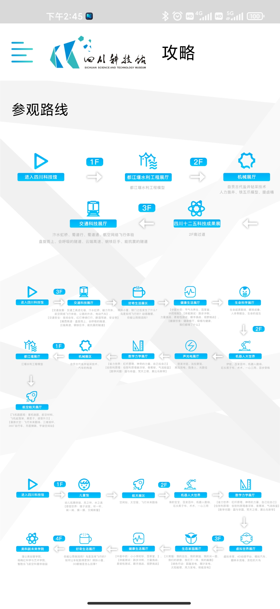
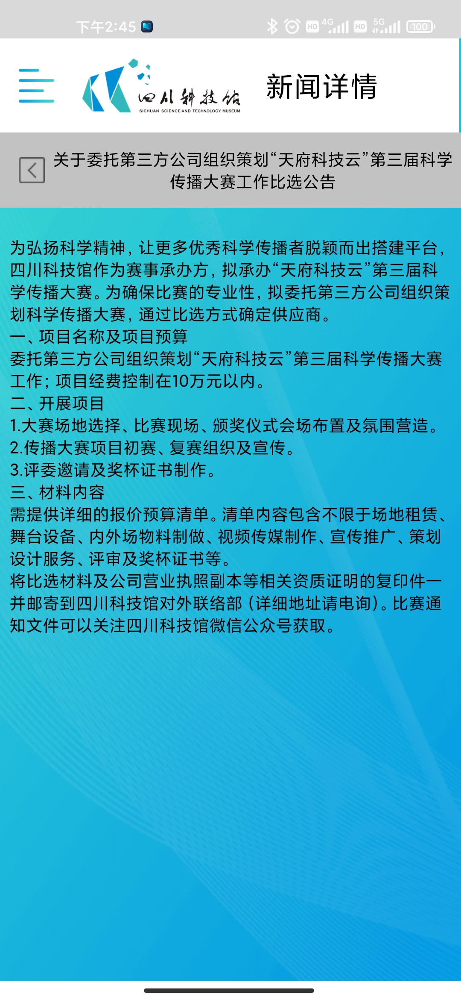

# 四川科技馆APP

## 效果
| 1    | 2    | 3    | 4    | 5    | 6    | 7    | 8    |
| ---- | ---- | ---- | ---- | ---- | ---- | ---- | ---- |
|      |      |      |      |      |      |      |      |


## 设计

使用figma进行UI设计 设计文件位于`Plan`目录下


## 安装部署

### APP端

使用 Android Studio 打开 并构建 gradle

在 `.\Src\mySCSTM\app\src\main\java\com\dkymore\myscstm\Data\Plyaer.java`下有MockUrl 请替换为您的服务器地址

```java
public String getServerUrl(){
	return isMock ? "http://127.0.0.1" : Secert.ServerUrl;
}
```

选择设备编译安卓即可

### 服务端

#### 本地部署

```bash
cd ./Src/Server
python -m venv .
.\Scripts\activate
pip install -r ./requirement.txt
python app.py
```

#### serveless 部署

以阿里云serveless为例 请参考项目下的`s.yaml`

## 开发教程

> ing...

