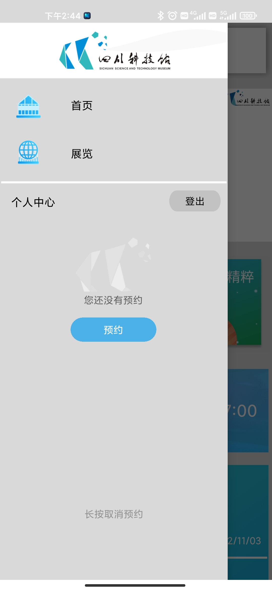
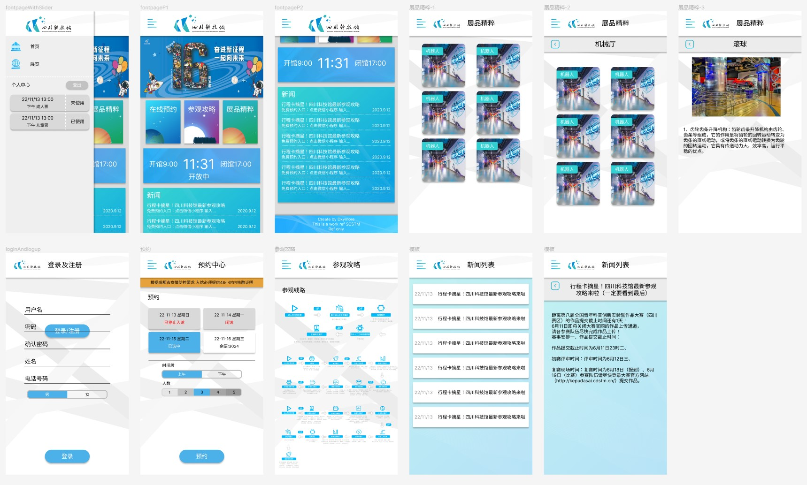

# 四川科技馆APP

## 说明

本项目是模仿四川科技馆手机官网的一个安卓项目并附带简易后端

旨在通过本项目学习安卓开发 

您可以在下方的[开发教程](#开发教程)找到文章教程 (目前还在完善 (~~如果我不咕咕咕的话~~))

APP使用 Android Studio + JAVA 开发

简易后端使用 python3.9 flask + mysql 开发 


## 效果

| 1    | 2    | 3    | 4    | 5    | 6    | 7    | 8    |
| ---- | ---- | ---- | ---- | ---- | ---- | ---- | ---- |
|      |      |      |      |      |      |      |      |

您可以在 [release]() 页面查看demo 下载 APP体验


## 设计

使用figma进行UI设计 设计文件位于`Plan`目录下



## 安装部署

### APP端

使用 Android Studio 打开 并构建 gradle

在 `.\Src\mySCSTM\app\src\main\java\com\dkymore\myscstm\Data\Plyaer.java`下有MockUrl 请替换为您的服务器地址

```java
public String getServerUrl(){
	return isMock ? "http://127.0.0.1" : Secert.ServerUrl;
}
```

选择设备编译安卓即可

### 服务端

#### 本地部署

```bash
cd ./Src/Server
python -m venv .
.\Scripts\activate
pip install -r ./requirement.txt
```

创建 secert.py 文件 写入您的mysql服务器相关信息

有关sql表结构参考`permission.py`文件末尾

```python
class mysql:
    host=''
    port= 22222
    user = ""
    passwd = ""
    db = "scstm"
    charset='utf8'
SecertToken = r""
```

最后运行 `python app.py`

#### serveless 部署

以阿里云serveless为例 请参考项目下的`s.yaml`


## TODO

- 完善代码注释
- 使用更好的阴影库
- 完善预约相关的网络请求
- 完善后端的部署相关事项


## 开发教程

### 项目结构

```tree
├─Assets 项目资源文件 如图片
│  ├─items 项目用到的json 如新闻等
│  └─show 图片
├─Plan 项目说明文件如UI等等
│  └─Show 展示图片
└─Src
    ├─Framewrok 简易框架
    ├─mySCSTM app应用
    └─Server 后端服务
```

### 教程

[APP](./Plan/APP开发1.md)

[后端](./Plan/简易后端开发1.md)

### APP端文件结构

```tree
│  AndroidManifest.xml
├─assets 动态加载的json文件
│      items.json
│      news.json
│      ... 及其他按需加载的图片	
├─java
	Java代码
└─res
    ├─drawable
    │    直接引用的图片
    ├─layout 各种布局文件
    │      activity_main.xml
    │      app_main.xml
    │      content_main.xml
    │      fragment_loginandlogup.xml
    │      fragment_main_page.xml
    │      fragment_newslist_detailpage.xml
    │      fragment_newslist_page.xml
    │      fragment_reserve_page.xml
    │      fragment_showup_detailpage.xml
    │      fragment_showup_innerpage.xml
    │      fragment_showup_page.xml
    │      fragment_walkthrough_page.xml
    │      item_newcard.xml
    │      item_news.xml
    │      item_reserve.xml
    │      item_showup.xml
    │      layout_header.xml
    │      slider_nav_view.xml
    │      
    ├─values 各种预定的常量
    │      colors.xml
    │      strings.xml
    │      themes.xml
```

### 后端文件结构

```tree
│  app.py 主要的文件
│  db.py 数据库模块
│  permission.py 用户登录及相关权限
│  requirements.txt 需要安装的模块
│  secert.py mysql服务器数据
```


